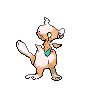
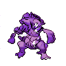
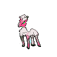
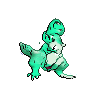
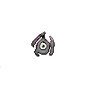
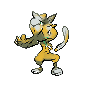

# PokeGAN
GAN for generating pokemon sprites

## Quickstart:

In a virtual environment with Python 3.7+, install everything in `requirements.txt`. Then, run `test.py`

# Samples:

                  
